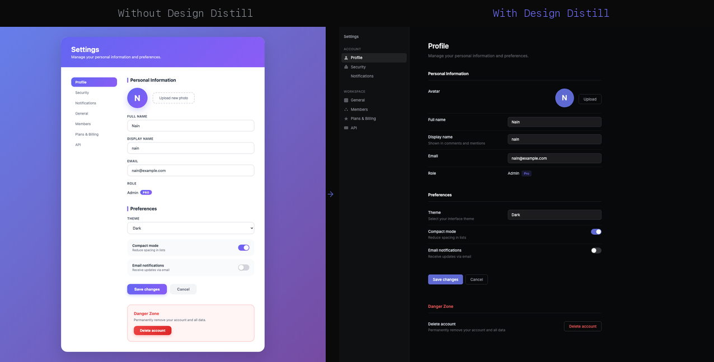

# Design Distill

**Stop generating generic-looking UIs.** Distill any website's real design system, then generate code that actually matches.

```
You:    "Distill linear.app, then make me a settings page"
Agent:  → extracts colors, fonts, spacing, components from linear.app
        → saves as DESIGN.md (Stitch-compatible)
        → generates a settings page that looks like Linear, not like every other AI output
```



*Same prompt: "Make a settings page like Linear." Left: generic AI output. Right: with Design Distill.*

## The Problem

Every AI-generated UI looks the same. Same gradients, same rounded cards, same blue buttons. You ask for "a settings page like Linear" and get generic Material Design.

## Install

```bash
# Install skills (design-distill + design-apply)
npx skills add Muluk-m/design-distill

# Install CLI dependencies (dembrandt + Playwright)
npx design-distill init
```

## Two Skills, One Library

```
  design-distill                    design-apply
  ──────────────                    ────────────
  "Distill linear.app"              "用 linear 做个博客主页"
        │                                 │
        ▼                                 ▼
  ┌──────────────┐               ┌──────────────────┐
  │  dembrandt   │               │  Load DESIGN.md   │
  │  (tokens)    │               │       +           │
  │      +       │── global ──▶  │  Re-screenshot    │
  │  screenshots │    library    │  source site      │
  │  (visual)    │               └──────────────────┘
  └──────────────┘                       │
                                         ▼
                                   Code that looks
                                   like the original
```

### design-distill — Extract Design Systems

```
design-distill https://linear.app     # extract from URL → save to library
design-distill ./my-app               # extract from local project
design-distill                        # list saved styles
```

Extracts design tokens via [dembrandt](https://github.com/nicholasgriffintn/dembrandt) + screenshots for visual ground truth. Outputs a [Stitch-compatible](https://stitch.withgoogle.com/docs/design-md/overview) `DESIGN.md` to the global library (`~/.config/design-distill/<name>/DESIGN.md`).

### design-apply — Generate with Style Consistency

```
design-apply 用 linear 做个博客主页    # load from library by name
design-apply 做个登录页                # auto-loads local ./DESIGN.md
```

Loads a design system, re-screenshots the source site for visual calibration, generates code strictly constrained to the original palette, fonts, and component patterns. Post-generation self-check ensures no style drift.

### CLI — Manage Your Library

```bash
npx design-distill init              # install deps + seed bundled styles
npx design-distill list              # list saved styles
npx design-distill list --json       # JSON output
npx design-distill show <name>       # display DESIGN.md content
npx design-distill path <name>       # output filesystem path
npx design-distill remove <name>     # delete a style
npx design-distill diff <name>       # compare saved vs. live site
npx design-distill preview <name>    # visual HTML preview in browser
```

## Architecture

```
design-distill/
├── bin/cli.js                 ← CLI entry (npx design-distill)
├── src/
│   ├── commands/              ← init, list, show, remove, path, diff, preview
│   └── lib/store.js           ← global library read/write
├── skills/
│   ├── design-distill/        ← design-distill skill
│   │   ├── SKILL.md
│   │   └── references/template.md
│   └── design-apply/          ← design-apply skill
│       └── SKILL.md
├── bundled/                   ← pre-bundled design system snapshots
└── package.json
```

**CLI** handles data operations (storage, dependencies, library management).
**Skills** handle AI behavior (extraction intelligence, style-constrained generation).
**DESIGN.md** is the interchange format between them.

## Compatibility

Works with **Claude Code**, **Codex**, **Openclaw**, and any agent that supports [skills](https://skills.sh).

Output follows the [Google Stitch DESIGN.md specification](https://stitch.withgoogle.com/docs/design-md/overview).

## License

MIT
